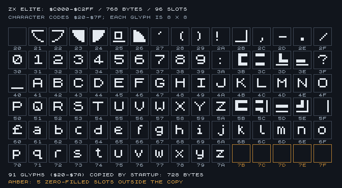
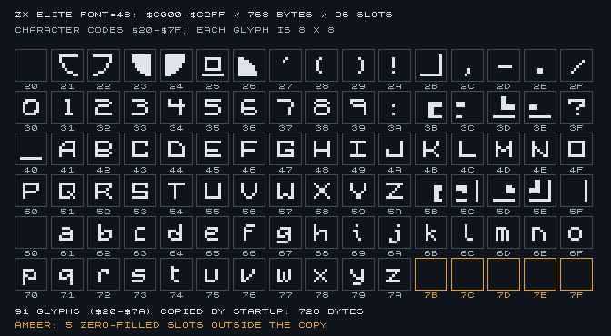
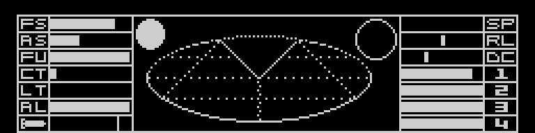
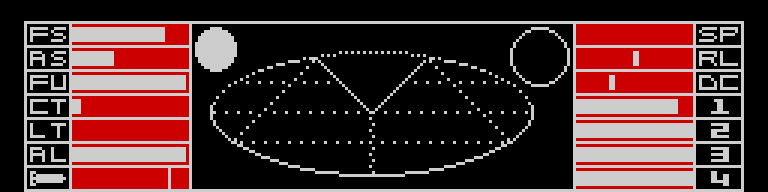

# Verified font and cockpit data

This document concerns the supplied **ZX Spectrum Elite 128K-compatible
TAP**. Addresses and formats were checked against its instructions and
execution, not inferred from the C64 or BBC versions.

“Elite 128K” is only the release name: this is the 48K game with its original
incompatibility on 128K Spectrum models fixed. It does not use expanded RAM,
bank switching or any 128K-only code or data.

The regions are now separate, named ASM includes. Every byte and original
address is preserved. The default `font=128` build remains identical to the
reference; `font=48` substitutes only the optional font data described below.

| Source | Symbol | Initial address range | Bytes | Format |
|---|---|---|---:|---|
| [font.asm](../src/data/font.asm) | `FontBitmap` | `$C000–$C2D7` | 728 | 91 glyphs, 8 bytes each |
| [cockpit-attributes.asm](../src/data/cockpit-attributes.asm) | `CockpitAttributes` | `$C700–$C7FF` | 256 | 32 x 8 colour cells |
| [cockpit-bitmap.asm](../src/data/cockpit-bitmap.asm) | `CockpitBitmap` | `$C800–$CFFF` | 2,048 | 256 x 64 pixels |

These ranges are observations of the original layout. Build expressions use
labels and `End - Start`; the source generator reads the boundaries from the
original `LD` operands at the copy sites. Assertions and linked-map checks
guard sizes and placement.

## Font

At startup, the instructions at `$716B` copy `$02D8` (728) bytes from `$C000`
to `$5D70`. The font occupies `$5D70–$6047` after relocation, immediately
before the game image at `$6048`.

`GetCharacterBitmap` at `$BB69` selects a glyph using:

```text
address = FontRuntime + (character_code - $20) * 8
```

The eight consecutive bytes are the glyph's rows, top to bottom. Bit 7 is
the leftmost pixel. `DrawCharacterRow` XORs each byte into a Spectrum screen
row, advances the source pointer by one and the screen address by `$100`.
The character set includes letters, digits and graphic tiles in some
punctuation positions; it is not a complete 256-character font.

The active character codes are **`$20–$7A` inclusive**, ending with lowercase
`z`: 91 x 8 = **728 bytes**. A 768-byte copy would overwrite 40 bytes at the
start of the game image. The bytes following the active source font are zero
in this tape, but they are not part of the startup copy.

The following image is the **original requested 768-byte preview**, retained
unchanged. It deliberately shows 96 slots (`$20–$7F`), including the five
zero-filled slots after the active font. Those five are marked in amber;
they must not be mistaken for copied glyphs or padding to add to the font.



### Optional 48K-style font

`font=128` selects the original `src/data/font.asm`. `font=48` selects
`src/data/font-48.asm`, extracted from the game payload (zero-based TAP block
5, loaded at `$6048`) of `assets/Elite128fixes/PATCH128.TAP`.

The replacement contains the same 91 glyphs and occupies exactly 728 bytes.
There are 237 changed font bytes and no changes to the copy instructions,
character renderer, runtime placement or other data. Custom graphic tiles
in font slots are preserved as supplied by the selected tape. The original
768-byte atlas above shows `font=128`. The corresponding `font=48` atlas is
retained below, with the same 96-slot layout and five inactive slots in amber.



Build with `make.bat font=48 verify=no`; it can be combined with Adder and the
single laser. Exact original-byte verification must remain explicitly disabled
for this intentional change. Structural checks and bounds are always enabled.
`tools/check_build_options.py` compares the entire output with the baseline
plus only the selected font/laser changes. `tools/check_graphics.py` verifies
both startup relocation and actual Z80 drawing/XOR-erasure of every glyph.

## Cockpit bitmap and colours

These two images are rendered directly from the assembled data at 3x integer
scale, without interpolation or emulator state. The first ignores attributes;
the second applies exactly the initial `CockpitAttributes` bytes.

| Monochrome bitmap | Initial stored attributes |
|---|---|
|  |  |

They can be regenerated with `python tools/render_cockpit.py`. Its report in
`build/graphics-check/cockpit-render.json` records source addresses, hashes,
dimensions and the observed attribute values. This table contains 186 bytes
of `$07` (white ink on black paper) and 70 bytes of `$17` (white ink on red
paper). No FLASH or BRIGHT bits are set in the initial table.

The bitmap uses the Spectrum's interleaved screen layout, not consecutive
scanlines. For local coordinates `x=0..255`, `y=0..63`:

```text
source byte offset = ((y & 7) << 8) | ((y & $38) << 2) | (x >> 3)
pixel mask         = $80 >> (x & 7)
```

Its destination is `$5000–$57FF`, the bottom third of the screen: physical
rows 128–191. It contains the frame, scanner, instrument labels and initial
instrument graphics.

The 256 attribute bytes are row-major, 32 columns x 8 character rows. Each
byte contains FLASH (bit 7), BRIGHT (bit 6), PAPER (bits 5–3) and INK (bits
2–0). They map to character rows 16–23 at screen `$5A00–$5AFF`.

Verified copy paths:

| Operation | Source | Destination | Length |
|---|---|---|---:|
| Startup font copy, `$716B` | `FontBitmap` | `FontRuntime` (`$5D70`) | 728 |
| Startup colours, `$7176` | `CockpitAttributes` | `CockpitAttributesRuntime` (`$5B00`) | 256 |
| Restore bitmap, `$743B` | `CockpitBitmap` (`$C800`) | `ScreenCockpitBitmap` (`$5000`) | 2,048 |
| Restore colours, `$7446` | Runtime buffer (`$5B00`) | `ScreenCockpitAttributes` (`$5A00`) | 256 |
| Save bitmap, `$8F47` | Screen (`$5000`) | Runtime bitmap buffer (`$C800`) | 2,048 |
| Save colours, `$8F52` | Screen (`$5A00`) | Runtime colour buffer (`$5B00`) | 256 |

The `$5B00` area has another lifetime: the self-modifying screen-backup routine
at `$8E5C..$8E94` copies 6 x 8 x 13 = 624 bytes, reaching `$5D6F`. Its reverse
path restores the saved screen region. Consequently, RAM occupied by the
old BASIC loader is not free storage. The font begins immediately after this
backup at `$5D70`. This was verified while testing the optional Adder build;
that variant does not put persistent data in this buffer.

The initial attribute data is genuinely used, but it is not simply copied
directly and permanently from `$C700` to video RAM:

1. Startup `$7176..$717F` copies the table from `$C700` to the mutable buffer
   at `$5B00`.
2. Screen setup can clear the display and set its attributes independently.
3. Cockpit restore `$7446..$744F` copies the current `$5B00` buffer into the
   bottom-third attribute VRAM at `$5A00`.
4. Later routines change selected colour cells. The table is therefore the
   initial state, while `$5B00` is the saved/current cockpit colour state.

Two direct runtime examples were checked by executing the original Z80 code
with controlled state:

- `$9A6E..$9A9C` writes two blocks of five instrument attributes across seven
  rows: **70 cells**. It selects `$17` or `$1F` and writes either directly to
  screen `$5A00` or to saved buffer `$5B00`, depending on the current view.
- `$A4F0..$A50D` changes the four attribute cells covering the circular
  indicator at `$5A28/$5A29/$5A48/$5A49`, and separately writes `$5AE7`.

The targeted result is retained in the historical research report
`docs/evidence/attribute-runtime.json`. This confirms both mechanisms:
the original attribute table is copied and used, and instrument colours are
also modified procedurally later. These are concrete verified examples, not
a claim that every remaining colour-writing path has already been named.

## Runtime reuse matters

The initial source bytes are **not read-only storage**. After initialization,
the `$C000–$CFFF` area is reused by graphics buffers and temporary stack
operations. The font remains safe because it was copied to `$5D70` first.

`BlitViewBitmap` uses the named aliases `ViewBitmapBuffer` (`$C000`) and
`ViewBitmapBufferSecondHalf` (`$C800`). At that point those bytes contain
rendering data, not the initial font and cockpit. `$C800` also holds backed-up
cockpit state during other screen transitions. Preserve this lifetime when
editing graphics or moving data.

## Verification

From the project root:

```bat
make.bat
verify.bat
python tools\check_graphics.py
python tools\render_cockpit.py
python tools\emulator_check.py --seconds 12 --key 3:0.5:N --key 5:0.5:SPACE --key 8:0.5:1 --name graphics-launch
```

`check_graphics.py` runs the original Z80 instructions with controlled RAM
and register setup. It verifies both startup copies, bitmap/colour restore,
backup-and-restore of changed panel data, and all **91 glyphs**: correct source
addresses, eight displayed rows and complete XOR erasure on the second draw.
No instructions are patched. Its report is in
`build/graphics-check/verification.json`.

The separate emulator check loads the rebuilt TAP through the supplied 48K
ROM and exercises normal startup and launch. The 48K environment is the
correct functional test for this 48K game; there is no separate 128K code
path. A physical 128K run would only check the compatibility fix itself. The
current emulator run is not a complete playthrough.

The three isolated graphics blocks contain **3,032 bytes**. See the current
reconstruction report and README for overall code/data classification totals.

## ECM indicator and scanner overlap

The original `L_A660` routine draws a two-by-two-cell E at columns 8/9,
rows 22/23. Both the active E and its blank replacement overwrite bit 0 of
`$50C9` (pixel 79,176), which belongs to the scanner ellipse. The original
cockpit bitmap supplies `$01` here. Scanner background restoration can
temporarily restore it, explaining the flickering after the first launch.
This behaviour also exists in the unmodified reference tape.

`scannerpixelfix=yes` preserves the old bit during the overlapping glyph's
first-row write; it does not change the shared text renderer or runtime font.
The replacement fits in the original 166-byte instrument region, including
the compacted missile-slot loop. `scannerpixelfix=no` retains the original.
See [Build variants](BUILD-VARIANTS.md#scanner-pixel-fix) for implementation
constraints, regression commands and the unchanged memory footprint.

## Laser and shared line renderer

The final patch in `info/ELIT128P_laser_mod-readme.txt` identifies two entries
now named in `src/game.asm`: `DrawLaser` at `$ECD4` and `DrawLine` at `$EE10`.
The latter is the shared clipped line renderer, not a laser-only routine.
HL and DE contain endpoint magnitudes; C contains their quadrant bits.

`laser=single` replaces only the dispatch at `$ECF2`, using
`src/single-laser.asm`. It draws one beam from the bottom centre while keeping
the original random endpoint movement near the crosshair. `laser=original`
preserves the original four calls that form the left/right beams. Other
callers of `DrawLine` are unchanged. Both entry addresses and the continuation
are checked by assembler assertions and preserved by source regeneration.

`tools/check_laser_variant.py` verifies actual line-renderer execution and
pixels for 256 RNG states in ZX Spectrum 48K mode. Normal ROM loading, launch
and firing were also traced for both Krait and Adder with the single laser.
See [Build variants](BUILD-VARIANTS.md#single-laser-and-identified-drawing-routines)
for the exact patch, commands and memory implications.
